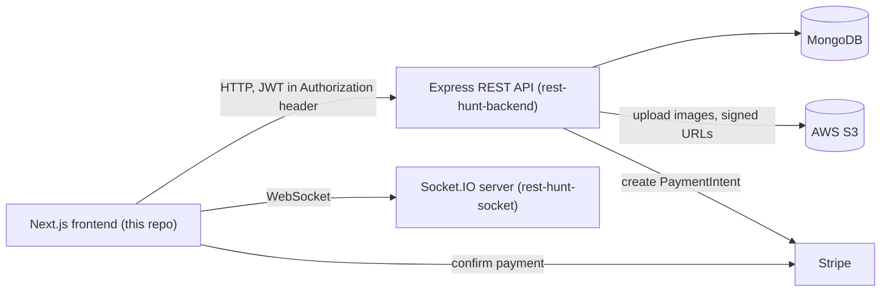

# RestHunt

RestHunt is a shared accommodation platform for students in Pakistan. Property owners list hostels and shared houses room by room, students search for a place, book a room for a date range and pay online, and an admin approves listings, bookings and payouts. This repository is the Next.js frontend. The REST API and the Socket.IO chat server live in their own repositories, linked at the bottom.

Live demo: https://rest-hunt.vercel.app

## Features

There are three roles: `user`, `property_owner` and `admin`. The role is chosen at signup (user or owner). The admin account is created by the API on startup from its environment variables.

### Visitors

- Landing page with destinations, trending and top properties, and an FAQ
- Search by property name, address or nearby site, with "load more" pagination
- Property page with room images, facilities, the list of rooms with prices, a Google Map of the location, FAQs, reviews and the owner's public profile
- A "popular" note on the property page based on how many times it was viewed in the last 24 hours

### Users

- Three-step signup (credentials, role, personal info) and login. The API returns a JWT that expires after 24 hours. The frontend keeps it in Redux and `localStorage` and logs the user out once it has expired.
- Save and unsave properties, and see them under Saved Properties
- Book a room by picking move-in and move-out dates. The total is prorated from the room's rent unit (per day, week, month or year).
- Checkout with a card through Stripe (Payment Element, PKR), or choose EasyPaisa or JazzCash, which shows transfer instructions and creates a pending booking for the admin to confirm
- Bookings list split into previous and present, and a booking detail page where the user can leave a star rating and a review
- Send an enquiry about a specific room. This opens a chat with the owner.
- Chat with message history and online/offline status
- Edit profile details and upload a profile picture

### Property owners

- Dashboard with shortcuts to listings, earnings and bookings
- Create a listing in three tabs: basic info (address through Google Places autocomplete, geocoded to coordinates), rooms (category, rent, facilities, image upload) and description with FAQs
- Save a listing as a draft or submit it for approval. Listings are grouped by status: Active, Draft, Pending, Denied and Paused.
- Edit, pause or delete a listing
- See the bookings made on their properties
- Earnings page with available balance, withdrawn and pending amounts, and a form to request a withdrawal by bank transfer, JazzCash or EasyPaisa

### Admin

- Admin panel at `/admin`, only reachable with the `admin` role
- List and delete users
- Approve or reject submitted properties
- Approve or reject bookings
- Approve or reject withdrawal requests

## Tech stack

| Layer | Tools |
| --- | --- |
| Framework | Next.js 14 (App Router), React 18, TypeScript |
| Styling and UI | Tailwind CSS, shadcn/ui components on Radix UI, react-icons, lucide-react |
| State | Redux Toolkit with one `auth` slice |
| Forms | Formik and Yup |
| Payments | Stripe (`@stripe/react-stripe-js`, `@stripe/stripe-js`) |
| Maps | `@react-google-maps/api`, `react-google-places-autocomplete` |
| Real time | `socket.io-client` |
| API (separate repo) | Node.js, Express, MongoDB with Mongoose, JWT, Multer, Stripe, AWS S3 |
| Chat server (separate repo) | Socket.IO |
| Hosting | API on AWS EC2, media on S3 |

## Architecture



The frontend talks to the API with plain `fetch` calls against `NEXT_PUBLIC_BACKEND_URL`. The home page and the property page are server components that fetch on every request. The other pages are client components that send the JWT as a Bearer token. `redux/AuthWrapper.tsx` restores the session from `localStorage` on load and redirects logged-out visitors away from private routes. `redux/AdminWrapper.tsx` does the same for `/admin`.

For card payments, the checkout page asks the API to create a Stripe PaymentIntent, confirms it in the browser with Stripe.js, and then creates the booking through the API. Creating a booking also reduces the room's availability and records an earning for the owner. A daily cron job in the API marks pending earnings as approved after 10 days.

Images go through the API. It uploads them to S3 and returns signed URLs, which `next/image` is allowed to load through the remote pattern in `next.config.js`.

Chat uses both servers. Messages are saved and loaded through the API. The Socket.IO server only keeps an in-memory list of connected users and forwards a message to the receiver if they are online. The frontend connects to it on the `/messages` page, emits `new-user-add` and `send-message`, and listens for `get-users` and `receive-message`.

## Project structure

```
app/                    Routes (App Router)
  admin/                Admin panel: users, properties, bookings, withdrawals
  booking/[id]/         Booking detail and review
  checkout/             Stripe payment form and manual payment options
  confirmation/         Booking confirmation
  dashboard/            Owner dashboard
  earnings/             Owner earnings and withdrawal request
  manage-properties/    Owner listings: list, new, edit
  messages/             Chat
  my-bookings/          Bookings for users and owners
  property/[id]/        Property page
  search/               Search results
  saved-properties/     Saved properties
  profile/, user/[id]/  Own profile and public profile
  login/, signup/, forgot-password/
components/             Shared components (cards, map, image upload, navbar, footer)
components/ui/          shadcn/ui primitives
containers/             Page sections, one folder per page
redux/                  Store, auth slice, provider, auth and admin wrappers
lib/utils.ts            Class name helper
data/                   Static data
public/                 Icons and images
```

## Getting started

### Prerequisites

- Node.js 18.17 or later (required by Next.js 14) and npm
- The API running locally or deployed: [rest-hunt-backend](https://github.com/sheharyarIshfaq/rest-hunt-backend)
- The chat server running, if you want messaging: [rest-hunt-socket](https://github.com/sheharyarIshfaq/rest-hunt-socket)
- A Stripe publishable key and a Google Maps API key with the Maps JavaScript and Places APIs enabled

### Environment variables

Create a `.env.local` file in the project root with these variables:

| Variable | Description |
| --- | --- |
| `NEXT_PUBLIC_BACKEND_URL` | Base URL of the API, including the `/api` prefix |
| `NEXT_PUBLIC_SOCKET_URL` | URL of the Socket.IO server (it listens on port 8800) |
| `NEXT_PUBLIC_STRIPE_PUBLISHABLE_KEY` | Stripe publishable key used on the checkout page |
| `NEXT_PUBLIC_GOOGLE_MAPS_API_KEY` | Google Maps key used by the property map and the address autocomplete in the listing form |

### Install and run

```bash
git clone https://github.com/sheharyarIshfaq/rest-hunt.git
cd rest-hunt
npm install
npm run dev
```

The app runs on http://localhost:3000.

Other scripts:

```bash
npm run build   # production build
npm run start   # serve the production build
npm run lint    # run next lint
```

## Not finished

- The forgot-password screens (email, 6-digit code, new password) are built, but they are not connected to the API yet.
- The search page has filter and sort components that are not wired to the search request.
- The notification dropdown in the navbar shows placeholder items.

## Related repositories

- API: [rest-hunt-backend](https://github.com/sheharyarIshfaq/rest-hunt-backend)
- Chat server: [rest-hunt-socket](https://github.com/sheharyarIshfaq/rest-hunt-socket)
